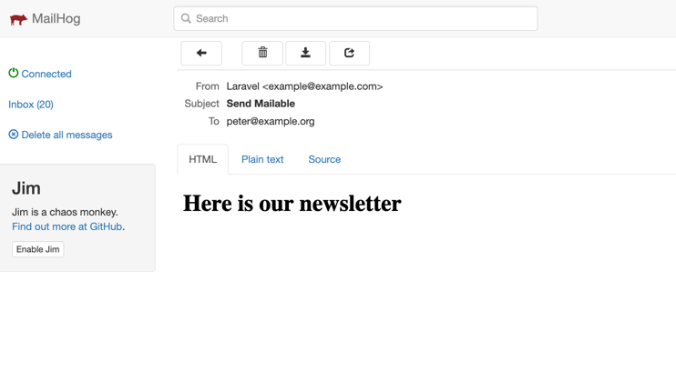

## About This Demo App

Technical task to demonstrate laravel queue,event and sending mail:

Create a form to subscribe to a newsletter.

1. Email field completed in a form on the page is submitted to backend, show a success message "Thanks for signing up!" after successful submission.

2. The email address is added to a newsletter recipients table

3. Dispatch an event for when the newsletter is added and use a Listener to handle step 4

4. Queue up a job that is responsible for sending the newsletter email to the given email address (the email can simply say "Here is our newsletter")

Please submit the code to a repository and share the link with us.

## Instalation

Ensure Docker is installed and running

In terminal cd to application root

Run: sail up -d  or ./vendor/bin/sail up

In terminal run: sail php artisan migrate

Login to Docker container with sail

Login to Docker container using  sail to start the queue worker by running:  sail php artisan optimize sail php artisan queue:flush  sail php artisan queue:work --timeout=0

## Browser

Navigate to http://localhost/newsletter-subscription and insert email to form and click the Subscribe To Newsletter button. 

## Database

Subscription emails are stored in the newsletter_subscriptions table

## MailHog

Navigate to http://localhost:8025 to check post submission curtsy subscription email

